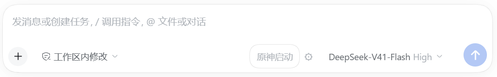

# DSH 原神启动

写代码累了？


**原神？启动**




- 自动识别已有原神位置，支持注册表、桌面/开始菜单快捷方式、常见安装目录和启动器 `config.ini`。
- 找不到时，使用 Windows 文件选择窗口选择 `YuanShen.exe`。
- 未安装时，点击 **未安装，打开官网**，在默认浏览器打开 <https://ys.mihoyo.com/>。
- 每位用户的路径保存在本机，无需修改插件源码。
- 首次通过 Windows 管理员授权创建专用任务，之后启动不再重复弹出权限确认。
## 支持环境

Windows 10/11、国服原神，以及提供 `conversation.input.right` 插槽的 DSH Desktop 或 Windows DSH Web 宿主。

免重复确认模式需要当前登录用户具有管理员账户资格，首次设置仍需授权。

本版本基于 DSH Desktop `0.2.0-rc.2` 验证。DSH 仍可能更新接口，其他版本需自行验证。

**游戏和原生选择窗口在运行 DSH 宿主的电脑上打开。** 通过浏览器访问远程 DSH 时，操作的是宿主电脑。

## 安装

下载发布的 `.tgz` 包后，在具有 `dsh` 命令的终端运行：

```powershell
dsh plugin --profile desktop add ./dsh-genshin-launch-1.2.1.tgz
```

使用 Web profile 时，将 `desktop` 改为 `web`。若桌面版未把 `dsh` 加入 PATH，请使用安装目录中 `resources/runtime/cli/bin/dsh.cmd` 的完整路径执行同样的参数。

完全退出 DSH（包括系统托盘）并重新打开。

## 第一次使用

1. 点击 **原神启动**。插件先尝试自动查找游戏。
2. 如果没有找到，点击 **选择 YuanShen.exe**，选中游戏目录里的程序。
3. 如果尚未安装，点击 **未安装，打开官网**，下载安装完成后重新检测或选择程序。
4. 如提示首次设置，点击 **启用免确认并启动**，在 Windows 管理员授权窗口中选择“是”。
5. 之后可以一键启动，无需重复确认权限。

按钮旁的齿轮可查看或更换游戏位置。取消选择不会自动打开网站，也不会启动游戏。

自动检测使用有限范围的安装线索，不会遍历整个磁盘。移动游戏或使用特别的安装布局时，可以手动选择。

## 如何查找安装位置

插件按以下顺序查找，找到有效的 `YuanShen.exe` 后保存到当前用户的本地配置：

1. 检查上次保存的位置和显式配置的位置。
2. 检查已有启动任务中的游戏位置，兼容旧版升级。
3. 读取 Windows 卸载注册表和桌面、开始菜单中的相关快捷方式，收集安装目录。
4. 检查各个就绪本地固定磁盘上的常见安装目录，以及启动器 `config.ini` 中记录的游戏位置。

这是基于安装线索的规则查找，不会递归扫描整个磁盘。下次使用会优先检查已保存的位置；路径失效时再重新查找。首次检测可能需要几秒，具体取决于硬盘、快捷方式数量及系统环境。查找耗时不包含游戏本身的启动和加载时间。

## 常见问题

### 没找到已经安装的原神

点击 **选择 YuanShen.exe**，选择游戏目录中的 `YuanShen.exe`，例如 `Genshin Impact Game` 文件夹内的程序。请选择游戏程序本身，而不是米哈游启动器或快捷方式。路径可以包含中文和空格。

### 点击按钮后提示需要授权

首次使用需要创建专用 Windows 计划任务。点击 **启用免确认并启动**，完成一次 Windows 管理员授权；以后通过这个任务启动。插件不会关闭 UAC 或修改全局权限设置。取消授权后可以稍后重试。

### 游戏移动了，或者启动任务失效

通过按钮旁的齿轮重新选择游戏程序，再按照提示重新设置启动任务。也可以运行插件目录中的 `setup.cmd` 修复授权。

### 安装后看不到按钮

确认安装到了正在使用的 profile，完全退出 DSH（包括系统托盘）后重启，并确认 DSH 版本支持 `conversation.input.right` 插槽。

### 电脑没有安装原神

点击 **未安装，打开官网**，默认浏览器会打开 [原神官网](https://ys.mihoyo.com/)。插件不会自动下载或安装游戏。安装完成后再次点击按钮检测，或手动选择游戏程序。

## 本地设置和计划任务

个人路径保存在 `%LOCALAPPDATA%/DSHGenshinLaunch/config.json`，不包含密码或 API 密钥，也不随发布包分发。

专用任务名为 `DeepSeekHarness-GenshinLaunch-<当前用户SID>`，按 Windows 用户隔离。任务只包含选定的原神程序，没有定时、开机或登录触发器，不保存用户密码。插件调用前会核对程序位置、用户身份、交互登录和权限级别。升级时也能使用当前用户在 1.1 版本创建的任务。

更换游戏位置后，可能需要重新确认一次授权，以更新任务的程序路径。系统 UAC 设置保持不变。

需要单独修复授权时，可运行插件目录里的 `setup.cmd`。任务设置结果写入 `%LOCALAPPDATA%/DSHGenshinLaunch/setup-result.json`。

## 卸载

```powershell
dsh plugin --profile desktop remove dsh-genshin-launch
```

若同时删除免确认任务，在管理员 PowerShell 中运行：

```powershell
$sid = [Security.Principal.WindowsIdentity]::GetCurrent().User.Value
Unregister-ScheduledTask -TaskName "DeepSeekHarness-GenshinLaunch-$sid" -Confirm:$false
```

若使用的是 1.1 版本遗留任务，其名称为 `DeepSeekHarness-GenshinLaunch`。

## 开发与打包

```powershell
npm test
npm pack
```

`npm pack` 会生成 `dsh-genshin-launch-1.2.1.tgz`。发布时提供该安装包和对应源代码即可；本机配置、授权结果及个人游戏路径不应包含在发布文件中。

## 说明

这是社区插件，与 DeepSeek 或米哈游无官方关联。插件只负责启动用户已经安装的游戏，以及打开原神官网。

源代码采用 MIT 许可证，不打包任何原神游戏文件或美术素材。
